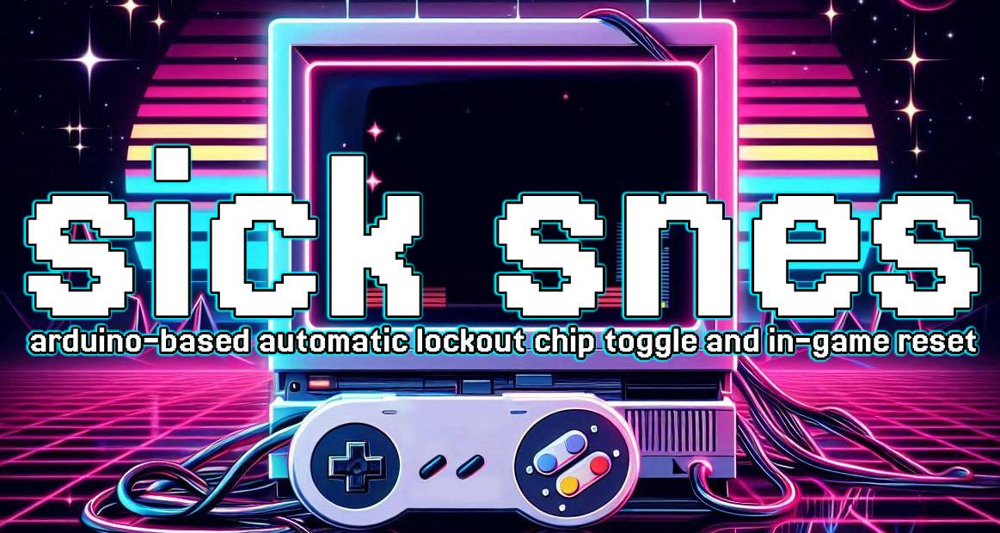
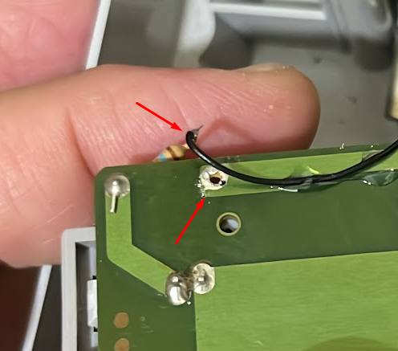
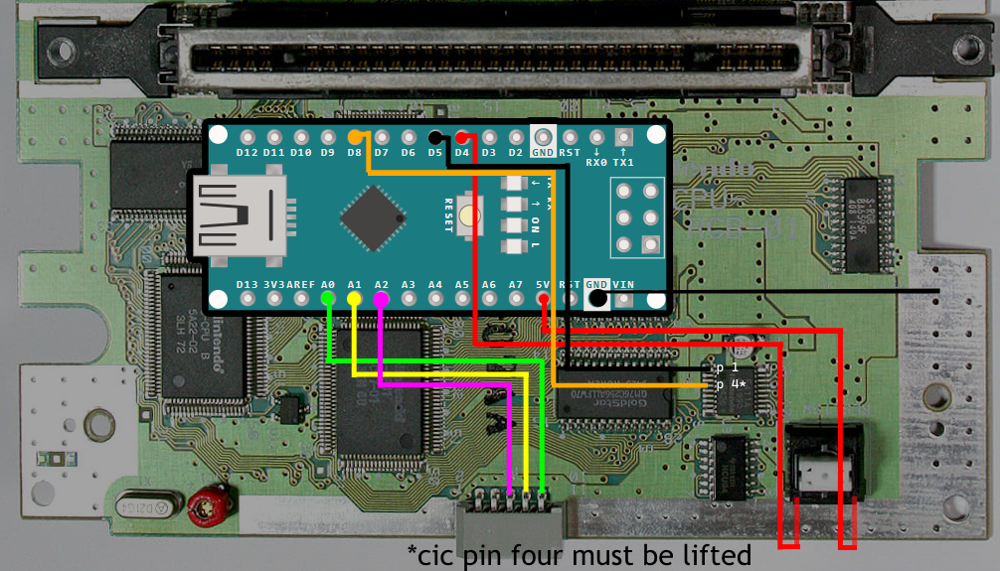
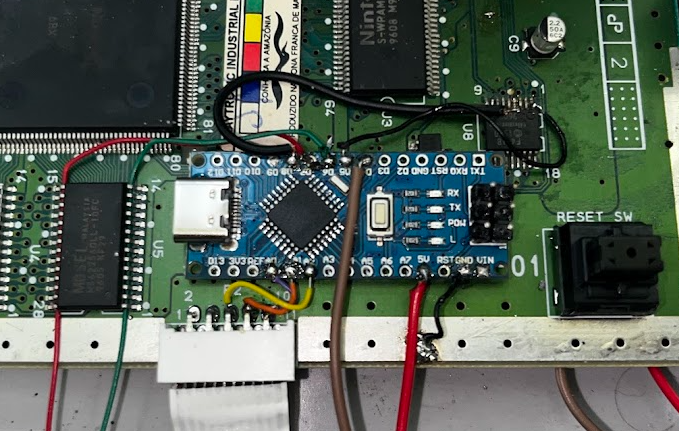

Disclaimer:

Anyone contributing to this mod is in no way responsible to whatever happens to your console after installing or removing it.


You do this at your own risk.


If you don't know what you're doing, go to someone that does.


Do NOT reset whilst you're saving data. If you do, you'll most likely corrupt your game save and/or cartridge.
You have been warned.


# ⛑️ sick snes - Automatic Lockout Chip Toggle and In-Game Reset

## 🗺️ Overview
sick snes is a mod for the Super Nintendo Entertainment System (SNES) that allows automatic lockout chip toggling and in-game reset functionality. If a cartridge fails the CIC (Checking Integrated Chip) check, the mod disables the CIC and resets the console automatically.

### 💎 Features
- **Automatic lockout chip toggle**
- **In-game reset functionality** using controller input
- **Compatibility with all SNES consoles**
- **LED indicators** for CIC status

### 🎬 Overview video
[https://youtu.be/vH6iCG8fFg8](https://youtu.be/vH6iCG8fFg8)

### 🕹️ Controls
- 🔄 **Soft Reset:** Press `L + R + START + LEFT`
- 🔄 **Long Reset:** Press `L + R + START + DOWN` (Some flashcarts only return to the menu with long reset)

#### Changing default in-game-reset shortcuts
1. Power on the console while holding start and it will start the configuration mode.
1. While the led blinks, press a 4 button combo to select the quick reset combo.
1. When the led starts blinking again, press a 4 button combo to select the long reset combo.

[Shortcut demo video](https://youtu.be/DvA6ozuwWZA)

*To reset to default IGR shortcuts hold select and power the console.

---

## 📋 Installation Guide
### 🔌 Wiring Instructions
Connect the Arduino to the SNES board as follows:

| Arduino Pin | SNES Connection   |
|------------|------------------|
| `5V`       | `Board VCC`       |
| `GND`      | `Board GND`       |
| `D4`       | `Reset Button`    |
| `D5`       | `CIC Pin 1`       |
| `D6`       | `Green LED`       |
| `D7`       | `Red LED`         |
| `D8`       | `CIC Pin 4**`     |
| `A0`       | `Controller Pin 10` |
| `A1`       | `Controller Pin 8`  |
| `A2`       | `Controller Pin 6`  |

**Note:** CIC Pin 4 must be disconnected (lifted) for proper operation.

### 💡 The LEDs
#### 🔴 Stock red LED
Disconnect the 5v pin resistor for the stock red LED, and connect the resistor to both D6 and D7. The LED will blink as an indicator when the lock-out chip is disabled.

#### 🎨 RGB LED
Connect the positive lead of the red LED to D7 and the positive lead of the green LED (the one that turns on when the lock-out chip is disabled) to D6.
If you are using LEDs rated for less than 5V, make sure to install appropriate resistors to prevent damage.

### ↻ Reset Button Wiring (Viewed from PCB Bottom)
```
         __________
        |  •    •  |
        |          |
        |          |
        | 5V    D4 |
         ‾‾‾‾‾‾‾‾‾‾
```

### 𓇲 CIC F411X Chip Wiring
```
     9 ______________________________ 1
      |  •  •  •  •  •  D8  •  •  D5  |
      |                               |
      |                               |
      |                               |
      |                               |
      |                               |
      |                               |
      |                               |
      |  •  •  •  •  •   •   •  •  •  |
    10 ‾‾‾‾‾‾‾‾‾‾‾‾‾‾‾‾‾‾‾‾‾‾‾‾‾‾‾‾‾‾ 18
```

### 🎮 SNES Controller Wiring (Viewed from PCB Bottom)
```
    10 _____________________________ 2
      |   A0   A1   A2   •    •     |
      |                             |
      | •    •    •    •    •    •  |
    11 ‾‾‾‾‾‾‾‾‾‾‾‾‾‾‾‾‾‾‾‾‾‾‾‾‾‾‾‾‾ 1
```

### 📈 Diagram




---

## 💻 Programming Instructions
To flash the Arduino with this mod, follow these steps:

### 💽 Not recommended: Standard Flashing via USB
1. Connect the Arduino to your computer via USB.
2. Use the Arduino IDE or a similar tool to upload the firmware.
3. If using the default bootloader, some consoles may require a manual reset workaround for *Street Fighter Alpha 2* (see below).

### 🧰 Recommended: Flashing via USBasp + Extreme Burner
Without the bootloader (or with MiniCore bootloader) the arduino startup is faster.

#### 🧱 1. Install driver with Zadig (one-time setup)
1. Download and open [Zadig](https://zadig.akeo.ie/).
2. Plug in your **USBasp programmer**.
3. In Zadig:
   - Go to `Options > List All Devices` and enable it.
   - Select `USBasp` from the dropdown list.
   - Choose the `libusb-win32` driver (or `libusbK` if needed).
   - Click `Install Driver`.

> This step allows Extreme Burner to recognize your USBasp programmer properly.

#### 💾 2. Flash the firmware using Extreme Burner - AVR
1. Open **Extreme Burner - AVR**.
1. Under `Chip`, select **ATmega328P** (or the chip you have).
1. Go to `File > Open Flash` and load the firmware `.hex` file [found here](https://github.com/lucaslealdev/sicksnes/releases/download/latest/sicksnes.hex).
1. Click the `Write All` button (chip icon with arrow) to start flashing.

> ⚠️ If you see a "signature mismatch" warning, it's safe to ignore it when using an ATmega328PB.
> The ATmega328PB has a different signature from the 328P, but they are compatible for this mod.

## 🔗 Compatibility

| SNES Model         | With bootloader (via usb) | No bootloader (USBasp) |
|------------------------|--------------------------------|--------------------------------|
| SNS-CPU-1CHIP-02      | ✅ Full                     | ✅ Full |
| SNS-CPU-1CHIP-03      | ⚠️ Need SFA2 workaround   | ✅ Full |
| SNS-CPU-GPM-02      | not tested   | ✅ Full |

Every other SNES board should be compatible with this mod, but might need SFA2 workaround when using a bootloader.

### ⚠️ Workaround for *Street Fighter Alpha 2* (only for default bootloader usage)
If the Arduino is flashed via USB (with the default bootloader), *Street Fighter Alpha 2* might not boot properly on your console.
- Hold the **reset button** until the Arduino initializes (~1.8s after power-up). This allows the game to start *after* the Arduino executes its code.

**Note:** This issue is rare and only affects *Street Fighter Alpha 2* on certain SNES consoles.

### 🙏 Help Improve Compatibility!  

If you test this mod on a different SNES model, please share your results!  
Let us know which console you used and whether everything worked as expected.  

This will help improve the compatibility list for future users.  

Thank you for your contribution! 🎮🔥

---

## ✨ Credits
- **Project Creator:** @lucaslealdev 🙋‍♂️
- **Year:** 2025 📅
- **Purpose:** Let's mod these games 🎮
- The disclaimer took from [here](https://github.com/pyroesp/PlayStation-1-Reset-Mod)
- **Youtube channel:** [Pixel que Byte](https://www.youtube.com/@PixelqueByte)
- Got the reset idea for this code from [JeffWDH/NES-In-Game-Reset](https://github.com/JeffWDH/NES-In-Game-Reset)

This project is provided as-is, with no guarantees. Modify and distribute at your own risk!

