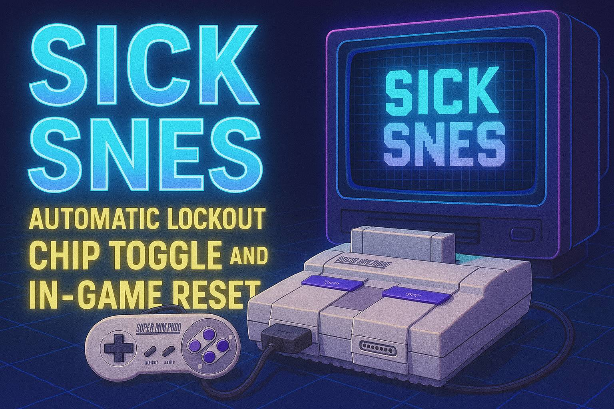

# sick snes - Automatic Lockout Chip Toggle and In-Game Reset

## Overview
sick snes is a mod for the Super Nintendo Entertainment System (SNES) that allows automatic lockout chip toggling and in-game reset functionality. If a cartridge fails the CIC (Check-In Chip) check, the mod disables the CIC and resets the console automatically.

### Features
- **Automatic lockout chip toggle**
- **In-game reset functionality** using controller input
- **Compatibility with all SNES consoles**
- **LED indicators** for CIC status

### Controls
- 🔄 **Soft Reset:** Press `L + R + START + LEFT`
- 🔄 **Long Reset:** Press `L + R + START + DOWN` (Some flashcarts only return to the menu with long reset)
- 🔒 **Forcefully Disable CIC:** Press `L + R + START + RIGHT`

### Quick demo
[https://youtu.be/vH6iCG8fFg8](https://youtu.be/vH6iCG8fFg8)

---

## Installation Guide
### Wiring Instructions
Connect the Arduino to the SNES board as follows:

| Arduino Pin | SNES Connection   |
|------------|------------------|
| `5V`       | `Board VCC`       |
| `GND`      | `Board GND`       |
| `D4`       | `Reset Button`    |
| `D5`       | `CIC Pin 1`       |
| `D6`       | `Green LED`       |
| `D7`       | `Red LED`         |
| `D8`       | `CIC Pin 4**`     |
| `A0`       | `Controller Pin 10` |
| `A1`       | `Controller Pin 8`  |
| `A2`       | `Controller Pin 6`  |

**Note:** CIC Pin 4 must be disconnected (lifted) for proper operation.

### Reset Button Wiring (Viewed from PCB Bottom)
```
         __________
        |  •    •  |
        |          |
        |          |
        | 5V    D4 |
         ‾‾‾‾‾‾‾‾‾‾
```

### CIC F411X Chip Pinout
```
    9 ______________________________ 1
      | •  •  •  •  •  D8   •  •  D5 |
      |                              |
      |                              |
      |                              |
      |                              |
      |                              |
      |                              |
      |                              |
      | •  •  •  •  •   •   •  •  •  |
    10 ‾‾‾‾‾‾‾‾‾‾‾‾‾‾‾‾‾‾‾‾‾‾‾‾‾‾‾‾‾ 18
```

### SNES Controller Pinout (Viewed from PCB Bottom)
```
    10 _____________________________ 2
      |   A0   A1   A2   •    •    |
      |                            |
      | •    •    •    •    •    • |
    11 ‾‾‾‾‾‾‾‾‾‾‾‾‾‾‾‾‾‾‾‾‾‾‾‾‾‾‾‾‾ 1
```


---

## Programming Instructions
To flash the Arduino with this mod, follow these steps:

### Standard Flashing via USB
1. Connect the Arduino to your computer via USB.
2. Use the Arduino IDE or a similar tool to upload the firmware.
3. If using a bootloader, some consoles may require a manual reset workaround for *Street Fighter Alpha 2* (see below).

### Flashing Without Bootloader (For Faster Boot)
For some consoles, *Street Fighter Alpha 2* may require a faster startup. To achieve this:
1. Use an external programmer (e.g., USBasp) to flash the Arduino without a bootloader.
2. This ensures the Arduino starts before the cartridge, avoiding conflicts.

### Workaround for *Street Fighter Alpha 2* (If Bootloader is Used)
If the Arduino is flashed via USB (with a bootloader), and *Street Fighter Alpha 2* does not boot properly on your console:
- Hold the **reset button** until the Arduino initializes (~1.8s after power-up). This allows the game to start *after* the Arduino executes its code.

**Note:** This issue is rare and only affects *Street Fighter Alpha 2* on certain SNES consoles.

## Already tested  

| SNES Model         | With bootloader (via usb) | No bootloader (USBasp) |
|------------------------|--------------------------------|--------------------------------|
| SNS-CPU-1CHIP-02      | ✅ Full                     | ✅ Full |
| SNS-CPU-1CHIP-03      | ⚠️ Need SFA2 workaround   | ✅ Full |

### Help Improve Compatibility!  

If you test this mod on a different SNES model, please share your results!  
Let us know which console you used and whether everything worked as expected.  

This will help improve the compatibility list for future users.  

Thank you for your contribution! 🎮🔥

---

## Credits
- **Project Creator:** @lucaslealdev 🙋‍♂️
- **Year:** 2025 📅
- **Purpose:** Let's mod these games 🎮

This project is provided as-is, with no guarantees. Modify and distribute at your own risk!

